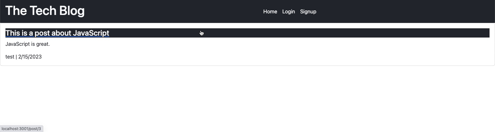

# MVC Tech Blog

## Description

This blog allows you to create posts, comments and new users. It will direct you to a dashboard once logged in in order to create/edit/delete your posts. People can also comment on the posts, and the comments will show up underneath single posts.

Deployed app: https://mvc-tech-blog-bootcamp-14.herokuapp.com/

## Table of Contents

- [Usage](#usage)
- [Screenshot](#screenshot)
- [Contact](#contact)

## Usage

Upon arriving at the site you will need to sign up. Upon signing up you are taken to the dashboard. From here, you can create a new post, and have people comment on your posts. You are then able to delete your posts at any time.

## Screenshot

## Contact

You can reach me via email at [gdjewell@gmail.com](mailto:gdjewell@gmail.com) or on GitHub at [@gdjewell](https://gdjewell.github.com).
